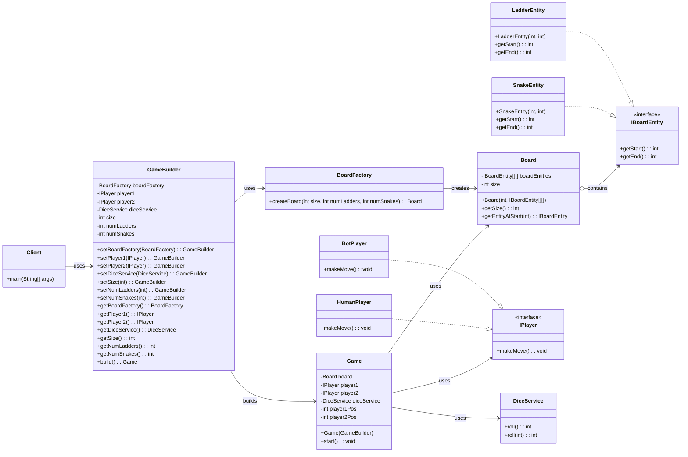

# Snake and Ladder – Low Level Design

## Class Diagram

```mermaid
classDiagram
    direction LR

    class Client {
        +main(String[] args)
    }

    class GameBuilder {
        -BoardFactory boardFactory
        -IPlayer player1
        -IPlayer player2
        -DiceService diceService
        -int size
        -int numLadders
        -int numSnakes
        +setBoardFactory(BoardFactory): GameBuilder
        +setPlayer1(IPlayer): GameBuilder
        +setPlayer2(IPlayer): GameBuilder
        +setDiceService(DiceService): GameBuilder
        +setSize(int): GameBuilder
        +setNumLadders(int): GameBuilder
        +setNumSnakes(int): GameBuilder
        +getBoardFactory(): BoardFactory
        +getPlayer1(): IPlayer
        +getPlayer2(): IPlayer
        +getDiceService(): DiceService
        +getSize(): int
        +getNumLadders(): int
        +getNumSnakes(): int
        +build(): Game
    }

    class Game {
        -Board board
        -IPlayer player1
        -IPlayer player2
        -DiceService diceService
        -int player1Pos
        -int player2Pos
        +Game(GameBuilder)
        +start(): void
    }

    class BoardFactory {
        +createBoard(int size, int numLadders, int numSnakes): Board
    }

    class Board {
        -IBoardEntity[][] boardEntities
        -int size
        +Board(int, IBoardEntity[][])
        +getSize(): int
        +getEntityAtStart(int): IBoardEntity
    }

    class IBoardEntity {
        <<interface>>
        +getStart(): int
        +getEnd(): int
    }

    class SnakeEntity {
        +SnakeEntity(int, int)
        +getStart(): int
        +getEnd(): int
    }

    class LadderEntity {
        +LadderEntity(int, int)
        +getStart(): int
        +getEnd(): int
    }

    class IPlayer {
        <<interface>>
        +makeMove(): void
    }

    class HumanPlayer {
        +makeMove(): void
    }

    class BotPlayer {
        +makeMove():void
    }

    class DiceService {
        +roll(): int
        +roll(int): int
    }

    Client --> GameBuilder : uses
    GameBuilder --> Game : builds
    Game --> Board : uses
    Game --> IPlayer : uses
    Game --> DiceService : uses
    GameBuilder --> BoardFactory : uses
    BoardFactory --> Board : creates
    Board o--> IBoardEntity : contains
    SnakeEntity ..|> IBoardEntity
    LadderEntity ..|> IBoardEntity
    HumanPlayer ..|> IPlayer
    BotPlayer ..|> IPlayer
```
